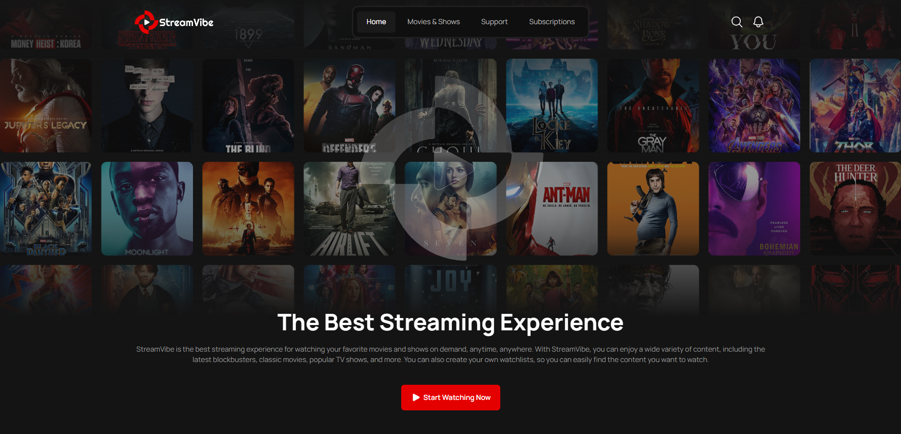

# StreamVibe

**StreamVibe** is a multi-page frontend application for a streaming service, built with **vanilla JavaScript** and a modern frontend stack.

The application consists of **six full-featured pages**, each containing multiple sections and complex UI elements. The project emphasizes clean architecture, reusable components, and maintainable code, without relying on heavy frontend frameworks.



## 🚀 Features

* Multi-page application (MPA)
* Fully responsive, mobile-first layout
* Tabs with dynamic content switching
* Mobile navigation menu with burger button
* Custom video player
* Multiple sliders and carousels
* Input masks for form fields
* Custom select component
* Reusable and modular UI components
* BEM methodology for class naming
* Scalable and well-structured codebase

All interactive components are implemented using **vanilla JavaScript**, with minimal reliance on third-party NPM libraries.

## 🛠 Tech Stack

* SCSS
* JavaScript (ES6+)
* Vite
* Minista (SSG)
* JSX templating (via Minista)

## 📦 Project Setup

### ⚡ Installation and Local Launch

Clone the repository and navigate to the project folder:

```bash
git clone https://github.com/Gidcher/stream-vibe.git
cd stream-vibe
```

Install dependencies:

```bash
npm install
```

Run the project in development mode:

```bash
npm start
```